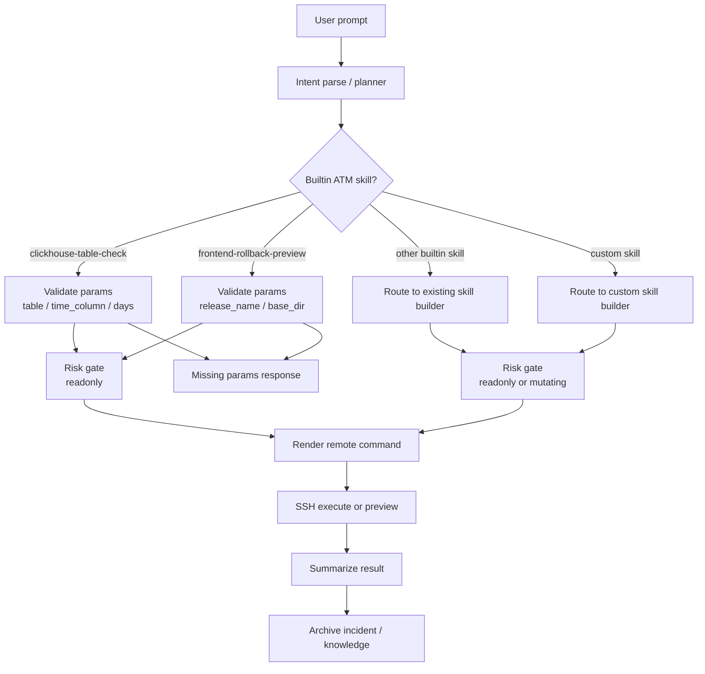

# ATM Agent Skill LangGraph

## Notes

- `clickhouse-table-check` is a read-only verification skill.
- `frontend-rollback-preview` is a read-only rollback precheck skill.
- Mutating rollback remains a separate builtin action: `frontend-rollback`.
